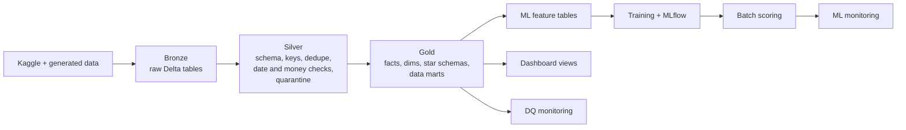

# Health Insurance ML Pipeline

An end-to-end lakehouse and machine learning pipeline for a health insurer, built with PySpark and
Delta Lake. Policy, member, claim and provider data moves through bronze, silver and gold layers
into fact and dimension tables, star schemas and KPI data marts; three classifiers (policy churn,
fraudulent claims and high-cost claims) are trained, tracked in MLflow and used for batch scoring,
with data-quality monitoring and CI in GitHub Actions.

[](https://github.com/ManojRam7/health_insurance_project/actions/workflows/ci.yml)


## Data

| Entity | Source | Rows |
|---|---|---|
| Policies | Kaggle health insurance cross-sell data, extended with generated fields | 381,109 |
| Members | Same source, one member per policy, with generated demographics and health fields | 381,109 |
| Claims | Kaggle healthcare provider fraud data (inpatient and outpatient claims) | 558,211 |
| Providers | Kaggle provider fraud labels, expanded to every provider seen in claims | 5,410 raw, 5,393 in silver |

`Data_Collection/` downloads the Kaggle files and generates the extra fields.

## Pipeline



| Layer | Notebooks | What happens |
|---|---|---|
| Pre-pilot | `_00_Pre_Pilot` | Spark and Azure Data Lake Storage (ADLS Gen2) connectivity through a service principal |
| Bronze | `_01_Bronze` | Raw loads into Delta tables, no transformation |
| Silver | `_02_Silver` | Schema enforcement, primary and foreign key checks, de-duplication, date repair, money validation, quarantine tables with reason codes, row-count metrics; one report per entity (`Report.txt`) |
| Gold | `_03_Gold/01_fact_dim_dm_star` | `fact_policies`, `fact_members`, `fact_claims`; channel, product line, region, member segment, claim type and provider dimensions; claims, policies and members star schemas; retention, member value and claims experience marts |
| Features | `_03_Gold/02_ML_Features` | `ft_policy_churn` and `ft_claims_risk` with stored train/test splits |
| Models | `_03_Gold/03_ML_Model_Training` | Training, model selection by ROC AUC, versioned models, MLflow tracking, batch scoring, monitoring tables |
| BI and DQ | `_03_Gold/04_BI_Dashboards`, `05_DQ_Monitoring` | Reporting views for Power BI and data-quality metrics |

`Master_Run_Pipeline.py` runs the notebooks in order and writes a run report for every run;
`--from-index N` restarts from a given step.

## Models

Spark ML models compared on the held-out test split; the best by ROC AUC is saved with a version
tag and registered in MLflow.

| Use case | Train / test rows | Selected model | ROC AUC | PR AUC | F1 | Accuracy |
|---|---|---|---|---|---|---|
| Fraudulent claim | 446,102 / 112,109 | Random forest | 0.987 | 0.991 | 0.766 | 0.793 |
| High-cost claim | 446,102 / 112,109 | Logistic regression | 0.999 | 0.991 | 0.961 | 0.964 |
| Policy churn | 304,760 / 76,349 | Random forest | 1.000 | 1.000 | 1.000 | 1.000 |

For fraud, logistic regression scored a slightly lower ROC AUC (0.987) but a much higher F1 (0.991),
so the decision threshold matters more than the model choice there. The perfect churn scores point to
target leakage: the generated churn label can be read directly from fields in the feature table.
The next iteration regenerates that label with noise and removes the leaking fields before the churn
model is used.

## Testing and CI

145 pytest tests: unit tests for data pipeline logic, feature engineering, ML utilities, schema
contracts and schema drift, a check that no secrets are committed, and integration tests that run
against a small gold sample in `data/gold_sample/`.

GitHub Actions (`.github/workflows/`):

- `ci.yml`: black, isort and flake8, then unit tests on Python 3.9, 3.10 and 3.11, then the
  integration tests on the gold sample.
- `code-quality.yml`: security and dependency checks.
- `run_pipeline.yml`: runs the full pipeline on demand.

## Run it

```bash
python -m venv .venv && source .venv/bin/activate
pip install -r requirements-dev.txt        # PySpark 3.5 + Delta Lake; Java 11+ required

python Master_Run_Pipeline.py              # full pipeline
python Master_Run_Pipeline.py --from-index 10
pytest tests/                              # or: make test
./scripts/run_mlflow_ui.sh                 # browse MLflow runs
```

To use ADLS instead of local storage, set `AZURE_CLIENT_ID`, `AZURE_TENANT_ID` and
`AZURE_CLIENT_SECRET` (or a Key Vault name in `config/config.py`). A Docker image runs the same
pipeline: `docker build -t health-insurance-ml . && docker run --rm health-insurance-ml`.

## Repository layout

```text
Data_Collection/           Kaggle download and data generation
_00_Pre_Pilot/             Spark and ADLS connectivity
_01_Bronze/                raw loads
_02_Silver/                cleansing, validation, quarantine (+ utils_silver.py)
_03_Gold/                  facts, dims, star schemas, marts, features, models, BI views, DQ
config/config.py           paths, Spark, ADLS and ML settings
src/                       data, ML, DQ and profiling utilities
scripts/                   model evaluation, registration and promotion
schemas/gold/              schema snapshots for contract tests
data/gold_sample/          small gold sample for integration tests
tests/                     unit and integration tests
Master_Run_Pipeline.py     orchestrator
Project_Documentation/     architecture notes
```

More detail: [architecture](Project_Documentation/Architecture/ARCHITECTURE.md) and
[gold layer](_03_Gold/Gold_layer_documentation.md).

## License

MIT
